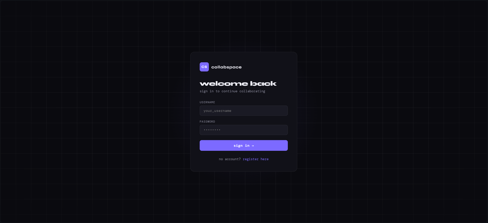
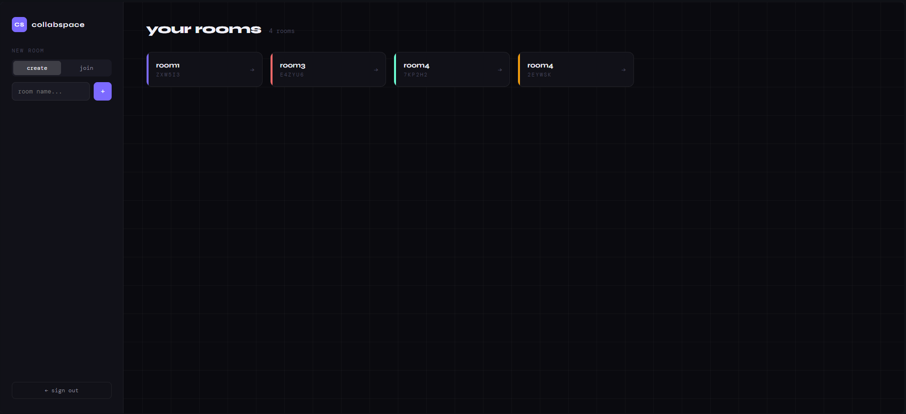
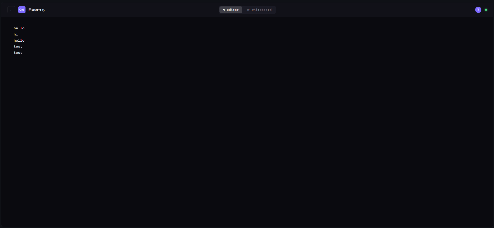
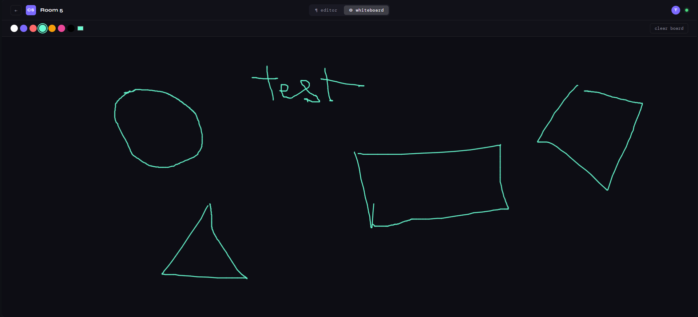

# CollabSpace

**Real-time collaborative editor and whiteboard** — built with FastAPI, WebSockets, Redis Pub/Sub, PostgreSQL, and React.

[](https://github.com/AdithyaRaoK14/CollabSpace-Real-time-collaborative-editor-and-whiteboard/actions/workflows/ci.yml)


---

## Screenshots

> Login


> Dashboard


> Text Editor (real-time sync)


> Whiteboard (real-time sync)


---

## Overview

CollabSpace is a self-hosted, production-grade collaborative workspace. Multiple users can join a shared room and edit text or draw on a whiteboard simultaneously — changes appear on all connected clients in real time, synced across horizontally scaled backend instances via Redis Pub/Sub.

---

## Architecture

```
React Client (Tab A)               React Client (Tab B)
       |                                   |
   WebSocket                           WebSocket
       |                                   |
FastAPI Instance 1              FastAPI Instance 2
       |                                   |
       └──────── Redis Pub/Sub ────────────┘
                      |
               PostgreSQL (persistence)
```

When a user edits text or draws a stroke, the FastAPI instance they're connected to publishes the event to a Redis channel (`room:{id}`). All FastAPI instances subscribed to that channel receive it and forward it to their local WebSocket connections. This means users on different backend instances stay in sync — enabling true horizontal scaling behind a load balancer.

---

## Features

- **Real-time text editing** — collaborative document editor with per-keystroke sync across all users in a room
- **Real-time whiteboard** — multi-color drawing canvas synced in real time across clients
- **Redis Pub/Sub** — horizontally scalable event distribution; messages route correctly across multiple FastAPI instances
- **JWT authentication** — stateless auth with bcrypt password hashing; all WebSocket connections are token-validated
- **Room system** — create rooms with auto-generated unique codes; join rooms using a 6-character code
- **Presence tracking** — live online user indicators; typing indicators with auto-clear
- **Document persistence** — all text and canvas state persisted to PostgreSQL; content loads on reconnect
- **Drift-free canvas sync** — canvas state managed via refs (not React state) to avoid rendering artifacts and cascading re-renders
- **Docker Compose** — full stack (FastAPI, React, PostgreSQL, Redis) containerized and orchestrated
- **GitHub Actions CI** — automated pytest suite on every push with ephemeral PostgreSQL and Redis services

---

## Tech Stack

| Layer | Technology |
|---|---|
| Backend | FastAPI, Python 3.11, Uvicorn |
| Real-time | WebSockets, Redis Pub/Sub |
| Auth | JWT (python-jose), bcrypt (passlib) |
| Database | PostgreSQL 15, SQLAlchemy (async), asyncpg |
| Frontend | React 18, Vite, Canvas API |
| DevOps | Docker, Docker Compose, GitHub Actions |
| Testing | pytest, pytest-asyncio, httpx |

---

## Getting Started

### Prerequisites

- Docker Desktop (with Docker Compose)
- Node.js 20+ (for local frontend development only)
- Python 3.11+ (for local backend development only)

### Run with Docker Compose

```bash
git clone https://github.com/AdithyaRaoK14/CollabSpace-Real-time-collaborative-editor-and-whiteboard.git
cd collabspace
docker-compose up --build
```

| Service | URL |
|---|---|
| Frontend | http://localhost:3000 |
| Backend API | http://localhost:8000 |
| API Docs (Swagger) | http://localhost:8000/docs |

---

## Project Structure

```
collabspace/
├── backend/
│   ├── app/
│   │   ├── core/
│   │   │   ├── auth.py          # JWT auth, password hashing
│   │   │   ├── config.py        # Settings via pydantic-settings
│   │   │   ├── database.py      # Async SQLAlchemy engine + session
│   │   │   ├── redis.py         # Redis connection management
│   │   │   └── websocket_manager.py  # Pub/Sub listener, local broadcast
│   │   ├── models/
│   │   │   ├── user.py
│   │   │   ├── room.py
│   │   │   └── document.py
│   │   ├── routes/
│   │   │   ├── auth.py          # /auth/register, /auth/login
│   │   │   ├── rooms.py         # /rooms/create, /rooms/join, /rooms/my
│   │   │   └── documents.py     # /documents/{id}, WebSocket /documents/ws/{id}
│   │   └── main.py
│   ├── tests/
│   │   └── test_auth.py
│   ├── Dockerfile
│   └── requirements.txt
├── frontend/
│   ├── src/
│   │   ├── pages/
│   │   │   ├── Login.jsx
│   │   │   ├── Register.jsx
│   │   │   ├── Dashboard.jsx
│   │   │   └── Room.jsx
│   │   ├── api.js               # Axios instance with JWT interceptor
│   │   ├── App.jsx              # Routes + protected route wrapper
│   │   └── index.css            # CSS variables, global styles
│   ├── Dockerfile
│   └── vite.config.js
├── .github/
│   └── workflows/
│       └── ci.yml
└── docker-compose.yml
```

---

## API Reference

### Auth

| Method | Endpoint | Description |
|---|---|---|
| POST | `/auth/register` | Register a new user |
| POST | `/auth/login` | Login, returns JWT access token |
| GET | `/auth/me` | Get current user info |

### Rooms

| Method | Endpoint | Description |
|---|---|---|
| POST | `/rooms/create` | Create a room (auto-generates 6-char code) |
| POST | `/rooms/join` | Join a room by code |
| GET | `/rooms/my` | List all rooms for current user |

### Documents

| Method | Endpoint | Description |
|---|---|---|
| GET | `/documents/{room_id}` | Fetch current document state |
| WebSocket | `/documents/ws/{room_id}?token=` | Real-time collaboration channel |

### WebSocket Message Types

```json
// Text edit
{ "type": "text_edit", "content": "..." }

// Canvas edit
{ "type": "canvas_edit", "content": [...strokes] }

// Typing indicator
{ "type": "typing", "is_typing": true }

// Presence update (server → client)
{ "type": "presence", "users": { "1": "alice", "2": "bob" } }
```

---

## How Redis Pub/Sub Works

Without Pub/Sub, broadcast only reaches users on the same FastAPI instance:

```
User A → Instance 1 → broadcast_local() → only users on Instance 1
```

With Pub/Sub, all instances participate:

```
User A → Instance 1 → redis.publish("room:42", message)
                              ↓
                       Redis channel "room:42"
                         ↙          ↘
              Instance 1           Instance 2
              listener             listener
                 ↓                    ↓
          local clients         local clients
```

Each FastAPI instance runs one background listener task per active room, using a **dedicated Redis connection** for subscribing (separate from the publishing connection — this is required since Redis does not allow a connection in subscribe mode to also publish).

---

## CI Pipeline

GitHub Actions runs on every push to `main`:

```yaml
# .github/workflows/ci.yml
- Spins up PostgreSQL 15 and Redis 7 as service containers
- Installs Python dependencies
- Runs pytest tests against the live services
```

Test coverage includes registration, login, duplicate user detection, and authentication error handling.

---

## Known Limitations

- **Last-write-wins** — concurrent edits from two users at the exact same millisecond can result in one overwriting the other. Production would use Operational Transformation or CRDTs (e.g. Yjs) for true conflict resolution.
- **No Alembic migrations** — schema is created via `create_all()` on startup. Production would use Alembic for versioned migrations.
- **Canvas grows unbounded** — strokes are appended indefinitely. A production system would implement stroke limits or canvas snapshotting.


